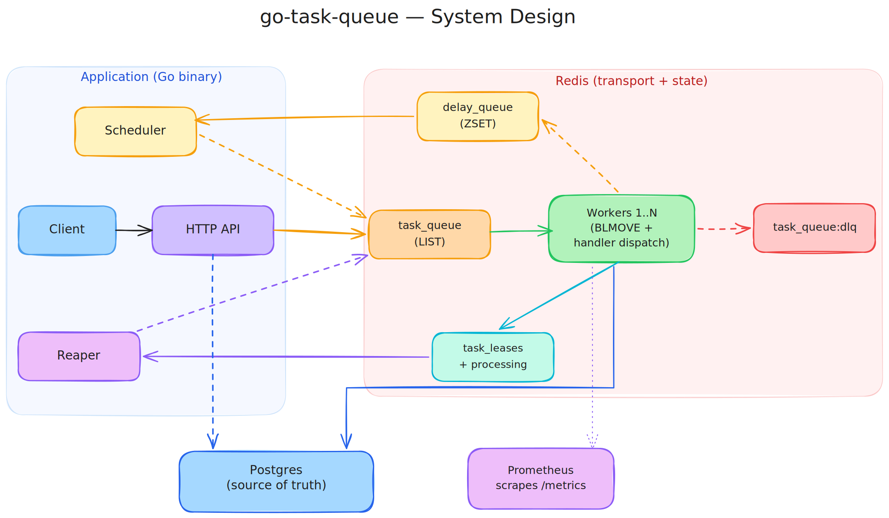

# go-task-queue

A distributed, persistent task queue written in Go. Producers `POST /tasks`, workers pull from Redis, results land in Postgres. Workers can crash, restart, or scale out — the queue keeps draining.



## Live demo

This project is deployed on Railway with the Go service, Postgres, and Redis running as separate services.

```bash
BASE_URL="https://go-task-queue-production.up.railway.app"

curl "$BASE_URL/healthz"

TASK_ID=$(curl -s -X POST "$BASE_URL/tasks" \
  -H 'Content-Type: application/json' \
  -d '{"name":"email.send","payload":"{\"to\":\"demo@example.com\",\"subject\":\"hi\",\"body\":\"hello from railway\"}"}' \
  | jq -r '.data.id')

curl "$BASE_URL/task?id=$TASK_ID"
curl "$BASE_URL/metrics" | grep tasks_
```

## What's interesting about it

- **At-least-once delivery via lease + visibility timeout.** Workers claim tasks atomically with `BLMOVE` from `task_queue` into a per-worker `processing:<id>` list, while writing an expiry into `task_leases`. If a worker dies, the **reaper** sees the expired lease and pushes the task back to the main queue. Two workers never fight over the same task under normal operation, and crashes don't lose work.
- **Postgres for durable state, Redis for transport.** Postgres is the source of truth for task records (status, attempts, results); Redis is the queue. They serve different jobs and you can rebuild Redis from Postgres if you ever lose it (see `internal/queue/recovery.go`).
- **Pluggable handlers.** Tasks are dispatched by name to handlers registered in `internal/worker/handlers.go`. Two real ones ship out of the box (`email.send`, `image.resize`); add your own with `worker.Register(...)`.
- **Exponential backoff with jitter.** Failed tasks are scheduled into `delay_queue` (a Redis sorted set keyed by unix timestamp). The scheduler promotes them back to `task_queue` when their time is up. After `MAX_ATTEMPTS`, tasks land in `task_queue:dlq` and Postgres `DEAD_LETTER`.
- **Prometheus metrics + health check.** `/metrics` exposes counters, histograms, and queue-depth gauges; `/healthz` pings both backends.
- **Graceful shutdown.** SIGTERM/SIGINT cancel a root context; workers finish their current task, the HTTP server drains, then we exit.

## Quickstart

```bash
cp .env.example .env
docker compose up -d
go run .
```

In another shell:

```bash
# enqueue an email job
curl -X POST localhost:7070/tasks -d '{
  "name": "email.send",
  "payload": "{\"to\":\"a@b.com\",\"subject\":\"hi\",\"body\":\"hey\"}"
}'

# check status
curl 'localhost:7070/task?id=<id>'

# scrape metrics
curl localhost:7070/metrics | grep tasks_

# inspect dead-letter queue
curl localhost:7070/tasks/dlq

# requeue a DLQ task after fixing the bug
curl -X POST 'localhost:7070/tasks/dlq/requeue?id=<id>'
```

## Endpoints

| Method | Path                    | Purpose                              |
|--------|-------------------------|--------------------------------------|
| POST   | `/tasks`                | Enqueue a task                       |
| GET    | `/task?id=`             | Read task by id                      |
| GET    | `/tasks/dlq`            | List up to 100 DLQ entries           |
| POST   | `/tasks/dlq/requeue?id=`| Replay a task from DLQ               |
| GET    | `/healthz`              | Liveness check (pings PG + Redis)    |
| GET    | `/metrics`              | Prometheus scrape endpoint           |

## Configuration

All via env vars (see `.env.example`):

| Var               | Default                             |
|-------------------|-------------------------------------|
| `DB_DSN`          | local Postgres on :5432             |
| `DATABASE_URL`    | fallback for managed Postgres       |
| `REDIS_ADDR`      | `localhost:6379`                    |
| `REDIS_URL`       | fallback for managed Redis          |
| `HTTP_PORT`       | `7070`                              |
| `PORT`            | fallback for hosted platforms       |
| `WORKER_COUNT`    | `3`                                 |
| `MAX_ATTEMPTS`    | `3`                                 |
| `LEASE_TIMEOUT`   | `30` (seconds)                      |
| `REAPER_INTERVAL` | `10` (seconds)                      |

## Running the tests

```bash
# unit tests
go test ./...

# integration tests (requires Docker — uses testcontainers)
go test -tags=integration -timeout=5m ./internal/integration/...

# benchmarks
go test -bench=. ./internal/worker/...
```

## Design decisions / tradeoffs

**Why Redis for the queue and not Kafka / NATS / SQS?**
Redis lists give you `BLMOVE` (atomic claim into a processing list), sorted sets give you the delay queue for free, and a single Redis instance handles tens of thousands of ops/sec — well past what a portfolio-scale workload needs. Kafka would be the right answer if you needed durable replay, partitioned ordering, or multi-day retention; this queue intentionally doesn't.

**Why Postgres if Redis already has the data?**
Redis values are ephemeral (LIST entries disappear once consumed). Postgres holds the durable record: every task's status transitions, retry count, result, payload. If Redis goes away, `RecoverTasks` in `internal/queue/recovery.go` rebuilds the queue from PG on next boot.

**At-least-once, not exactly-once.**
A worker can finish the task and crash before acking. The reaper will then requeue it and another worker will run it again. Handlers must be idempotent. Exactly-once would require a dedup key + PG insert in the same transaction — straightforward to add, but I left the contract honest.

**Why in-memory heaps were removed.**
The first cut (visible in git history) used `container/heap` priority/delay queues with `sync.Cond`. They worked great in-process but couldn't survive a restart and couldn't be shared across worker hosts. Moving the queues into Redis was the cost of becoming actually distributed. The `Priority` field still exists on `Task` and is honored at enqueue-time by giving high-priority items their own queue (left as a follow-up — see "What's next").

**Reaper is O(N·M).**
The reaper scans every `processing:*` list to find a task whose lease expired. That's fine up to ~hundreds of in-flight tasks. To go beyond that, store `task_id -> processing_key` alongside the lease so reclaim is O(1).

## What's next

- A second main-queue for high priority (`task_queue:high`) and a worker preference rule.
- Idempotency keys + dedup for exactly-once on retries.
- OpenTelemetry traces alongside the existing Prometheus metrics.
- Horizontal-scale benchmark with `k6` and a published throughput number.

## Layout

```
.
├── main.go                            # wires everything together
├── internal/
│   ├── config/      env-driven config + tests
│   ├── database/    Postgres + GORM
│   ├── handlers/    HTTP endpoints
│   ├── metrics/     Prometheus metrics + queue-depth sampler
│   ├── models/      Task struct
│   ├── queue/       startup recovery
│   ├── redis/       client + key constants
│   └── worker/      worker loop, scheduler, reaper, handler registry
└── internal/integration/ end-to-end tests via testcontainers
```
